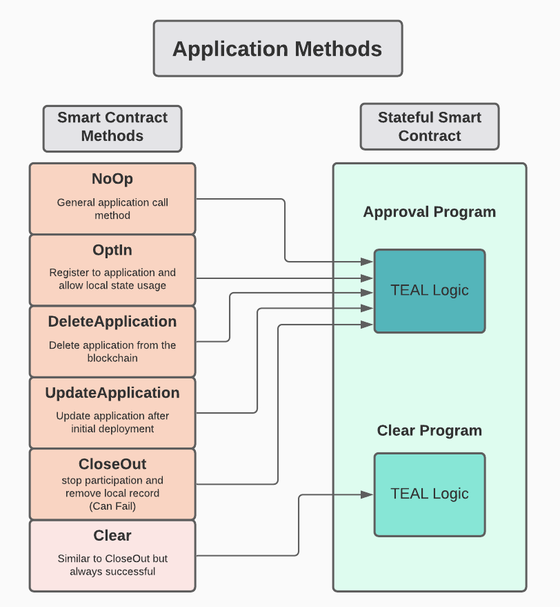

### Algorand Application Transaction



### Install Dependencies

```shell 
python venv env
source env/bin/activate
pip install -r requirements.txt
```

### Reference

[Algorand-Pyteal](https://developer.algorand.org/docs/get-details/dapps/pyteal/)